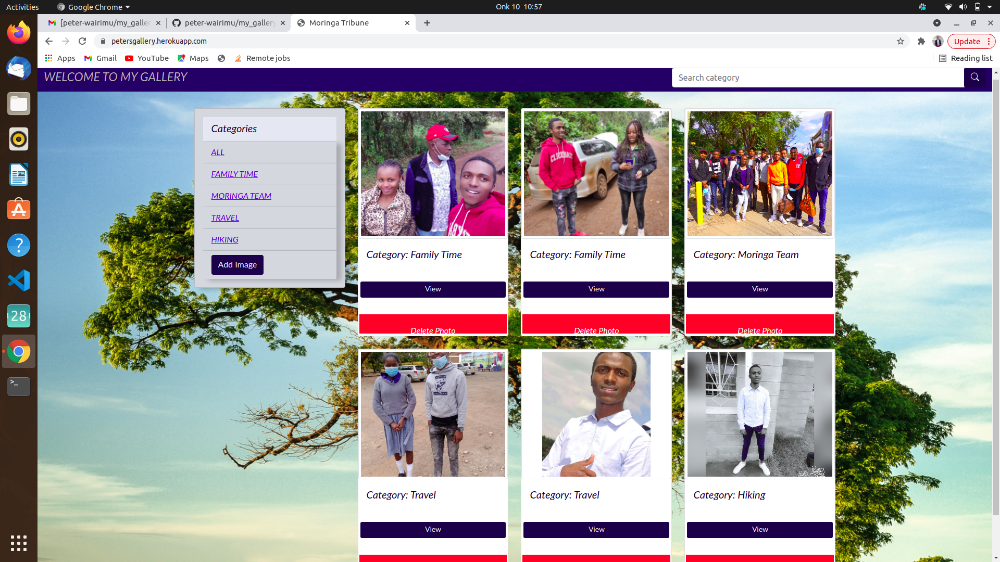
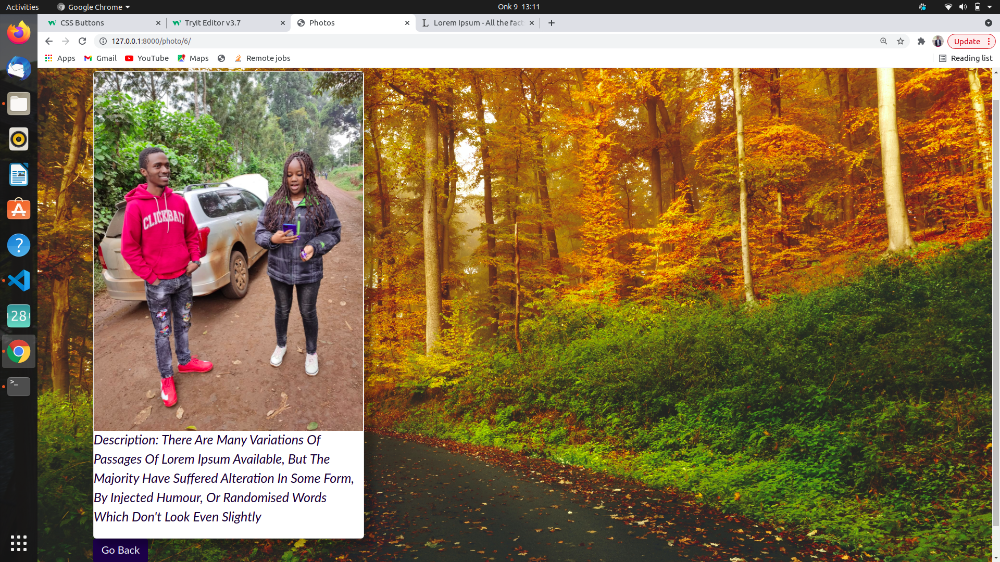
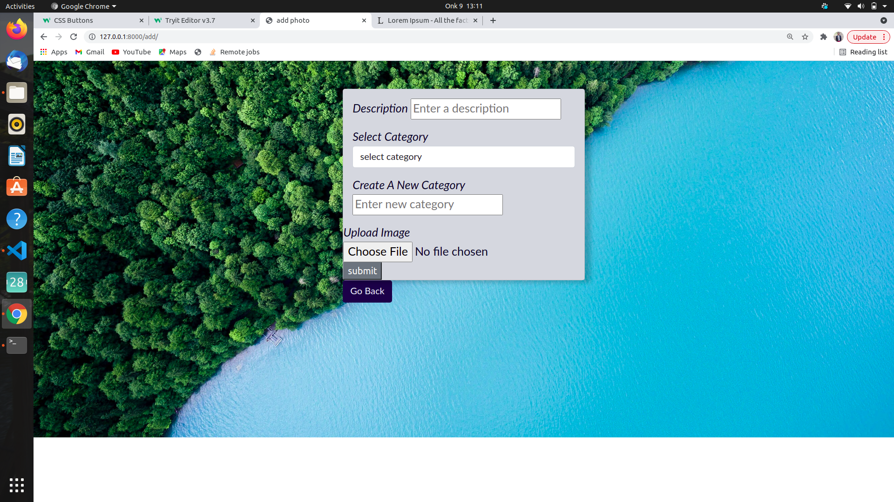

# My Photo Gallery

## Date, 9/10/2021

## By Peter Chege Wairimu.

# Description 

My photo gallery is a simple web where a user can get to interact with photos that i have posted also a user can get to add an image or delete an image. 

# Instructions

(i). click on the view button to focus on that one image u can zoom in and zoom out.

(ii). Click on the search bar input any category u want to search and it will be displayed.

(iii). click on the card on the left to choose and view any category you are intrested in

# Technologies Used

### (1).HTML.

### (2).Css.

### (3).Bootstrap.

### (4). Javascript.

### (5). Python/Django.

## 

# Support and contact details
Incase of any queries or any clarification you can contact me via email or phone.

### email. chegewairimu66@gmail.com

### phone. 0707569387

# License

License permission is hereby granted ,free of charge to anyone obtaining a copy of these software and associated documentation to deal in the software without restrictions including without limitation the rights to use ,copy modify ,publish and distribute copies of these software and to permit persons to whom the software is furnished to do so,subject to the following conditions:

The above copyright notice should be included.

## Copyright (c) 2021